In this post, I'll show you how to expose two applications running in a Kops provisioned kubernetes cluster using several techniques, increasing in complexity. 
- Exposing the applications internally within the cluster using Kubernetes services [easy and well-known]
- Exposing the applications externally using Nodeport services [easy and well-known]
- Setting up traffic-routing using nginx-ingress controller [somewhat tricky]
- Exposing a bare-metal nginx-ingress controller through the load balancer created by Kops [never done before, AFAIK :-)]

## Abbreviations
Henceforth, I'll be using the following abbreviations:
LB: LoadBalancer
NLB: Network LoadBalancer
CLB: Classic LB
ALB: Application LB
SG: Security Group
Svc: Kubernetes Service
NP: NodePort service
CRD: Custom Resource Definition
k: Kubectl
k8s: Kubernetes

## Prerequisities 
This post covers a lot of technologies and assumes a solid understanding of:
- Kubernetes architecture and concepts such as pods, services, deployments, namespaces etc.
- AWS concepts such as EC2 instances, security groups, load balancing
- Setting up and operating a kubernetes cluster using Kops

While this material has been designed and tested on a Kops provisioned cluster, the concepts should apply to an EKS cluster as well. 

## Architecture of a Kops kubernetes cluster
I created my kubernetes cluster on AWS using the following command:
```angular2html
kops create cluster --zones=us-east-1a --cloud=aws --name=${NAME} --state=${KOPS_STATE_STORE} --discovery-store=s3://ankur-kops-k8s-oidc-store/${NAME}/discovery --node-size t2.medium --master-size t2.medium --node-count 1 --dns=None
```
For more info, see Kops [documentation](https://kops.sigs.k8s.io/getting_started/aws/). Kops provisions the EC2 instances, security groups, inbound/outbound rules etc that are required for the instances on your cluster to talk to each other. The details of how kubernetes networking works is a topic of another post. Here I'll focus on how external traffic gets to your cluster LB and how is it routed to internal k8s services. We'll use these concepts repeatedly throughout the post

In AWS EC2 console, click on the NLB created by Kops. 
Under listeners, you'll see two listeners:


Port 443 is used by kubectl to interact with your k8s cluster. On an ubuntu system, the configuration file used by kubectl is located in ~/.kube. If you look in this file, you'll see the name of the cluster and user under your current kubectl context. The certificates used for SSL comms are located here also. 

Port 3988 is used internally by kubernetes and not relevant to us. 

If you click on target group associated with port 443, you'll see that it points to port 443 on an EC2 instance in your control plane.

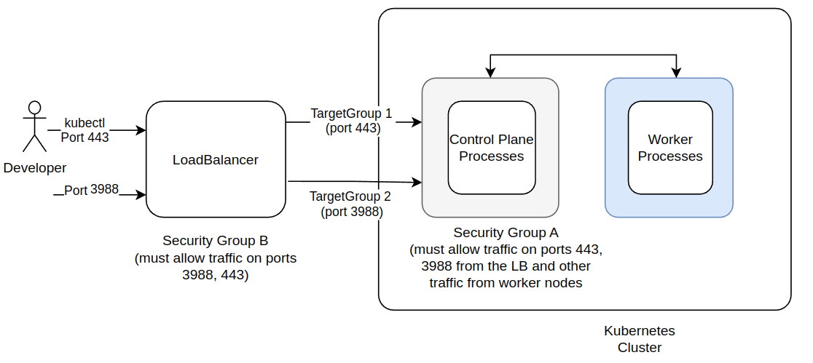

As shown in the picture above, to accept traffic on ports 443, the LB must open those ports for inbound traffic in its attached security group. If you check the inbound rules of the SG attached to the NLB, you'll see the corresponding rule

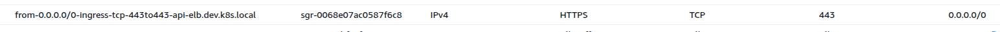

Similarly, the security group attached to the EC2 instance targeted by the target group must also allow traffic on port 443 from the LB's security group. You should verify this is the case. We'll use this concept several times in this post.

Note that Kops creates a Network LB. There are also Classic LB and Application LB. See AWS docs for the difference between the three. Later in the post, we'll use a CLB as well. 

## Test applications

We'll use two dummy applications `planet` and `dashboard`. These applications are simple flash servers that serve simple messages (with a random number appended, so refreshing results in a different message) on several paths on ports 5000 and 6000. See code in planet_app and dashboard_app directories for details. Dockerfiles used to build the corresponding docker images and run the servers are also in the application directories. I've already built and pushed the corresponding images to my dockerhub account. 

## Application access internally using k8s services
Create a namespace named test using `kubectl create ns test`. Then deploy a kubernetes deployment by running `k apply -f flask_server_deployment.yaml`. This should create 1 pod and 1 clusterIP svc in the test namespace. Check that the pod and services are running. 

Run a curl pod in an interactive session as below

`kubectl run curl --image=radial/busyboxplus:curl -i --tty --rm`
Then curl one of the pods and verify you are able to access the server exposed by that pod

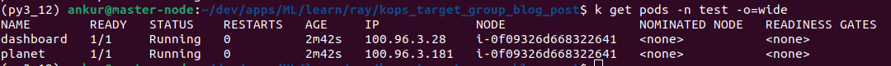

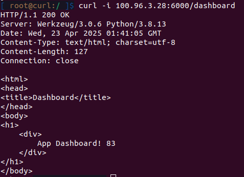

Do the same through the corresponding service. Note that the services are exposed on a different port than the targeted application. This is just to show that the two ports don't have to be the same.

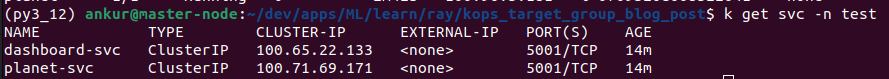

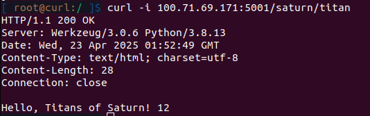

Kubernetes services provide a layer of abstraction over your application pods. If you delete and recreate the application pods, their internal IP addresses will likely be different.. however you can still access your application using the same service IP or service name. This happens through EndPoint objects. When a Service is created, Kubernetes automatically creates an Endpoints object. This object tracks the IP addresses and ports of all the pods that match the Service's selector. When Pods are created or deleted, or their IP addresses change, the Endpoint object is automatically updated to reflect the current state of the pods. 

You can check the matching endpoints created by k8s using `kubectl get endpoints -n test` The IP addresses should match the IPs of your application pods.

As clusterIP services can only be accessed internally within the k8s cluster, our applications are not accessible outside the cluster
## Application access outside the cluster using Nodeport services 

To access the applications outside the cluster, we can use Nodeport service. This service type exposes a nodeport on every instance of the cluster. The application can then be accessed using instance_public_ip:nodeport. On AWS, the instance must also have a security group with inbound rule that allow traffic on that port (or a range of ports that includes that port)

To deploy a Nodeport service that selects our applications, run `kubectl apply -f flask_nodeport_svc.yaml`. This will set up two nodeport services in the test namespace that expose planet app on port 31000 and dashboard app on port 32000. To expose these ports to the internet, we must modify the security group attached to one of our cluster instances to allow for traffic on those ports. This is shown in the screenshots below.
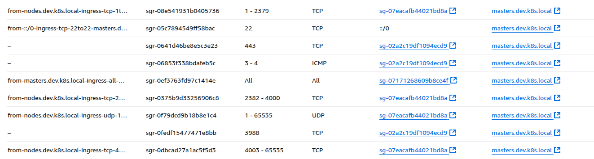

Add inbound rule

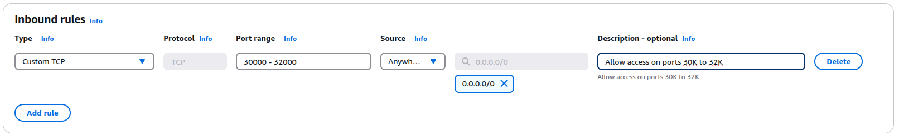

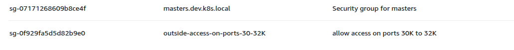

Creating a nodeport service opens up the nodeport on every instance of your cluster, so you only need to modify the security group for either the control plane or the worker group instances. Then you can access the nodeport service using the public ip of the instance. For example, in the diagram below the planet and dashboard nodeport is exposed on the control plane and the worker instances, but external traffic enters via control plane instance that has the right inbound rule attached to its security group.

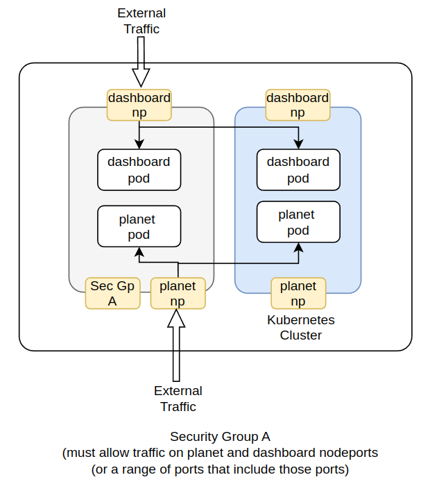

With the inbound rule added, curl the public ip of one of your cluster instances and you should be able to access the planet and dashboard apps on ports 31000 and 32000 respectively. 

You can also create nodeport services using the k8s imperative commands `kubectl expose pod..` but this doesn't let you pick a specific nodeport. To do that, you must create a yaml and specify the nodeport under ports. 

Nodeport is easy to set up, but quite insecure unless you restrict incoming traffic from a set of trusted IPs or add authentication/authorization mechanism before traffic gets to your cluster. There is another downside too, which we'll discuss next.

## Application access outside the cluster using nginx-ingress CLB

Wouldn't it be nice if instead of creating two nodeport services for each of the two applications, we could create a single service that could be exposed on a single publicly accessible port, and route traffic appropriately? Eg., `<public IP or DNS name>:port number/dashboard` goes to the dashboard app, while `<public IP or DNS name>:port number/planet` goes to the planet app? 

Kubernetes services can't support this, because one service can only target a particular replica set (group of pods of the same type). Services don't support routing rules. 

The way to do such routing is to use an ingress. A popular ingress in the open source k8s world is [nginx-ingress](https://kubernetes.github.io/ingress-nginx/user-guide/basic-usage/). There are two types--cloud and baremetal.

Let's start with cloud ingress. 

### Using cloud nginx-ingress
You can install a cloud nginx-ingress as below.
`k apply -f https://raw.githubusercontent.com/kubernetes/ingress-nginx/controller-v1.12.1/deploy/static/provider/cloud/deploy.yaml`
'
`kubectl -n ingress-nginx get pods`

You should see the nginx-ingress controller pod running. This controller checks for updates to ingress CRDs that describe routing rules and installs the routing rules. Now check for services in the ingress-nginx namespace

You'll see ingress-nginx-controller and ingress-nginx-controller-admission services. Out of these, ingress-nginx-controller is more relevant to our discussion here. This svc is of type LoadBalancer, meaning that it does two things:
- exposes ports 80 and 443 (for HTTP and HTTPS traffic respectively) on NodePorts
- Creates a Classic LoadBalancer (on AWS) that directs traffic to these ports

It is instructive to see the properties of this classic load balancer. Go to the list of load balancers on your EC2 console and click on the new load balancer just created. You should see two listeners that direct traffic on ports 80 and 443 to the nodeports we saw above.

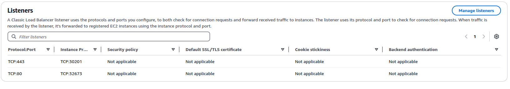

Now click on Target Instances. You should see the instance id of your control plane or worker instance group. To allow traffic from the newly created CLB, an inbound rule is added to the SG attached to this instance group that allows all traffic from the CLB. Similarly, inbound rules on the CLB SG allow HTTP and HTTPS traffic from anywhere. So that's how external traffic enters the CLB and is directed to our cluster through the nodeports created by nginx-ingress. 

Now if you copy and paste the classic load balancer's URL in a browser, you should see the nginx '404 not found' page. That shows us that all the routing and security groups are set up correctly and we are able to hit the ingress controller. 

### Configuring CLB Health Check
Go back to the classic load balancer created by nginx-ingress and select the Health Checks tab. You'll see something like this:
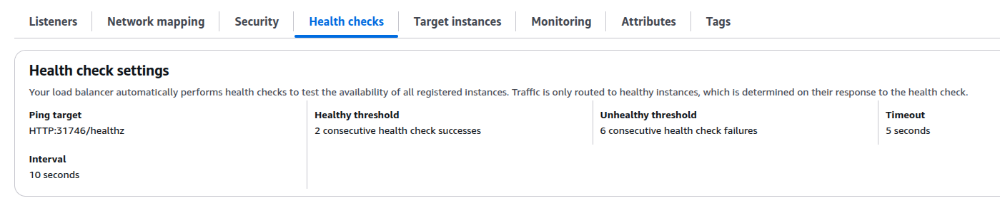

So the health check pings /healthz on port 31746. Where is this health check configured and where is this port 31746 coming from? 

If you inspect the [yaml](https://raw.githubusercontent.com/kubernetes/ingress-nginx/controller-v1.12.1/deploy/static/provider/cloud/deploy.yaml) for the nginx-ingress controller and search for health, you'll see a liveness port configured at port 10254. 

Let's try curling it..Get the IP address of the nginx-controller pod using `k get pods -n ingress-nginx -o=wide` and then curl it in the interactive session in the busybox pod we created above:

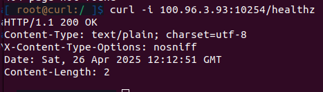

Notice that in pod yaml, port 10254 is not listed under ports of the nginx-ingress-controller deployment. Liveness/readiness ports don't need to be explicitly exposed because k8s automatically does that for us. 

So that's great. But where is the 31746 coming from? This took me sometime to figure out.. run a `k describe svc -n ingress-nginx ingress-nginx-controller`

you'll see something like this:

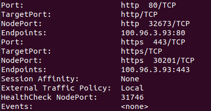

Notice the HealthCheck NodePort.. so this is where the port 31746 comes from. 

Another setting to note in the deploy.yaml is externalTrafficPolicy. According to Kubernetes [docs](https://kubernetes.io/docs/tasks/access-application-cluster/create-external-load-balancer/), this field can have two values--Cluster (default) and Local. In the deploy.yaml for the cloud config, this is set to Local. According to the docs, Local preserves the client source IP and avoids a second hop for LoadBalancer and NodePort type Services, but risks potentially imbalanced traffic spreading.. I found this a bit confusing.. however one implication of this setting is on the host field in the ingress settings, as we'll see below. 

The externalTrafficPolicy setting is only available for LoadBalancer service type. You'll get an error if you try to set it for any of the other two (ClusterIP and NodePort) service types.

Now that we've set up the ingress controller, let's see how we use it. Deploy the ingress-clb.yaml:

`k apply -f ingress-clb.yaml`

Now if you go to a browser and type `your_clb_url/planet_app/mars`, you should see  a response from the planet app. Try the dashboard app as well on the dashboard_app prefix. Few points to note:

- The ingress must be in the same namespace as the services. When I tried to install the ingress in another namespace and access the planet and dashboard services using their FQDN (fully qualified name--eg., planet-svc.test.svc.cluster.local), I get an error
- The host is set to the CLB DNS with a wild card for the first part of the CLB DNS label. See [this] (https://kubernetes.io/docs/concepts/services-networking/ingress/) for wild card matching rules. If the host name in the ingress rules doesn't match the host name in your request header, ingress controller will drop your requests.. try it by removing the * or introducing a typo in the value of the host field..
- The ingress must translate `your_clb_url/planet_app/mars` to '/mars' etc., in order to hit the endpoints defined in your server code. This is done using rewrite rules. The pathType must be set to 'ImplementationSpecific' in order for this to work..(so many gotchas!)

It is also instructive to check the logs of the ingress-controller pod using kubectl logs.. It shows the HTTP requests received by the controller and how they are being routed.
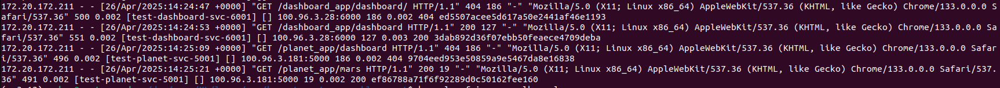

The diagram below describes what's going on. 

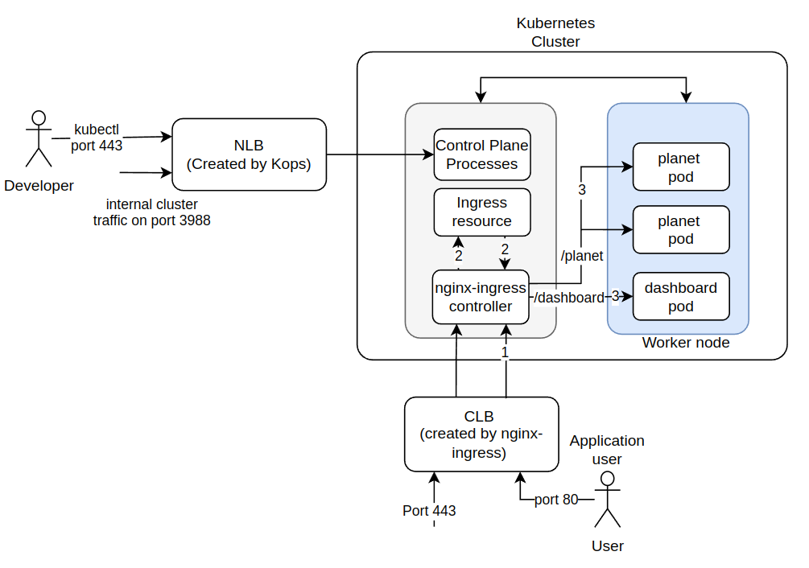

Developers still access the cluster using the Kops created NLB. Users of our dashboard and planet apps use the CLB created by nginx-ingress over port 80 (or 443 for secure traffic). This traffic is forwarded to the nginx-ingress controller pod exposed over a NodePort service using listener rules (1). The nginx-ingress controller then uses routing rules configured in the ingress CRD (2) to route traffic to the application pods (3) 

The documentation for nginx-ingress is pretty bad. They should describe these gotchas clearly through examples.. that's the pitfall of using open-source SW! It can be feature rich, but hard to use.. 

## Application access outside the cluster using nginx-ingress CLB

The setup described so far should work for most people and keeps the LB through which applications running on the cluster are accessed separate from the LB used to manage the cluster. However, LBs cost money.. eg., a depending on usage, a CLB could cost ~20$ a month! I was wondering, can't we use the NLB already created by Kops to access my applications via ingress? The answer is yes, and this section will teach you how.

First destroy the cloud ingress. You should delete the ingress objects first, followed by the resources created by ingress controller
```angular2html
k delete -f ingress-clb.yaml
k delete -f https://raw.githubusercontent.com/kubernetes/ingress-nginx/controller-v1.12.1/deploy/static/provider/cloud/deploy.yaml
```
Verify that all resources in the ingress-nginx namespace and the namespace itself is deleted, and the AWS resources created by the ingress controller are deleted as well.

Now, we need to install a different kind of ingress, called a [baremetal ingress](https://github.com/kubernetes/ingress-nginx/blob/main/docs/deploy/baremetal.md). This ingress type doesn't create a LB and relies on the user to direct traffic to the ingress controller. 

Let's install the baremetal ingress:
```angular2html
k apply -f https://raw.githubusercontent.com/kubernetes/ingress-nginx/controller-v1.12.1/deploy/static/provider/baremetal/deploy.yaml
```
Check the services and pods in the ingress-nginx namespace. Similar to the cloud ingress setup, you'll see a NodePort service that exposes ports 80 and 443. If you run describe svc on the ingress-nginx-controller service, you'll see something like:

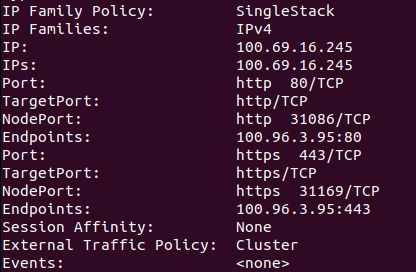

This is similar to what we saw earlier, but notice that External Traffic Policy is set to Cluster, and Health Check NodePort is missing. 

Now check your AWS resources. Notice that the baremetal configuration doesn't create any LoadBalancers or security groups. So how do we use this ingress? Let's try using the NodePorts exposed by this controller. 

Reapply the ingress-clb.yaml
```angular2html
k apply -f ingress-clb.yaml
```
Now try to access your servers using the public IP addresses of one of the EC2 instances on your cluster followed by the nodeport on your home workstation (you must make sure there is a security group attached to one of the instances in your cluster that allows traffic on the nodeport)

```angular2html
curl -i <public_ip_of_your_EC2_instance>:<nodeport number>/dashboard_app/dashboard
```
You'll get a 404. Why? It is because for External Traffic Policy: Cluster, the source IP of a HTTP request is always the IP address of the Kubernetes node that received the request from the perspective of NGINX (see section Source IP address [here](https://github.com/kubernetes/ingress-nginx/blob/main/docs/deploy/baremetal.md). This means that the URL provided in the host field in our ingress will no longer match the IP in the HTTP request header, and the request will be dropped. You could set the host field to the IP of one of your kubernetes nodes, but this is fragile, because the request could originate from any of the nodes in your cluster.. thankfully the host field in the ingress spec is optional, so the easiest solution is to not use it at all. This is shown in `ingress-clb-no-host.yaml`. If you delete the existing ingress, and install apply `ingress-clb-no-host.yaml` then your curl command should work.

Now let's try to modify the Kops created NLB to direct traffic to the nginx-ingress controller. The basic steps are:
- Create a new listener rule that directs traffic to a new target group on a port of your choosing (I've used port 8000 here, you can pick another port if you wish)
- Create the new target group. This target group should direct traffic to the control plane EC2 instance on the nodeport exposed by the baremetal nginx-ingress controller. 
- Set up the health check as shown in the screenshots below (this is important!)
- Modify the NLB SG to allow in-bound traffic on port 8000 and the control plane SG to allow traffic from the NLB on the nodeport (or a wider range of ports that includes the nodeport)

Adding a listener to the NLB that forwards traffic to a new target group
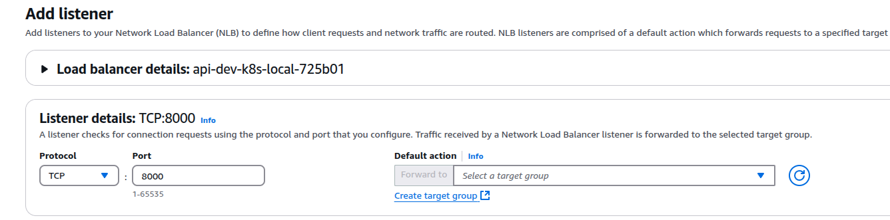

Configuring the new target group
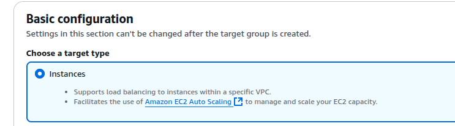

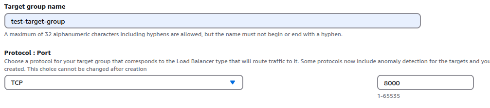

Configuring health check

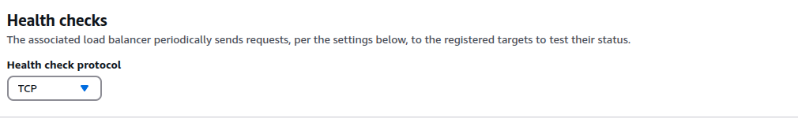

On the register targets screen, select the EC2 instance in your kubernetes control plane, and pick the NodePort corresponding to port 80 in your ingress-nginx-controller service configuration, as shown below.

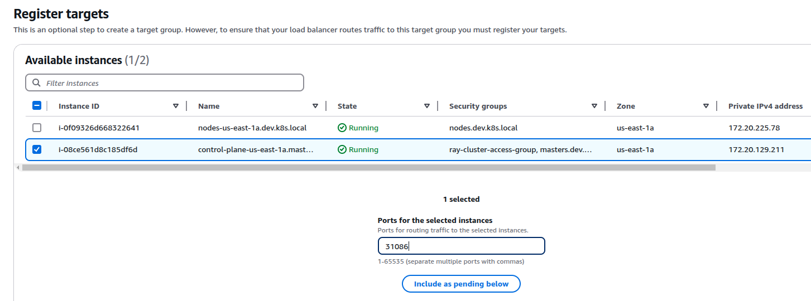

Now give the target group a few seconds to get into a healthy state. Now when you go back to your LoadBalancer, you should see something like this:
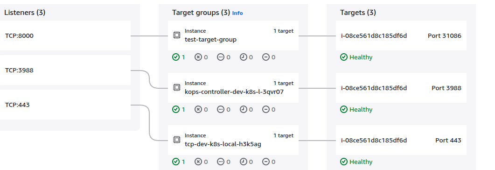

As we saw earlier, port 443 is for you to interact with your kubernetes cluster through kubectl. Port 3988 is the kops controller serving group (according to Kops documentation). For interacting with our application, we are using port 8000.. this can be any port of your choosing. Now try accessing our servers through the load balancer URL

```angular2html
curl -i <load balancer A record>:8000/dashboard_app/dashboard
```
If all was configured correctly, you should be able to see the dashboard application! Otherwise, check if the inbound rules on the SGs were set correctly and then check the nginx-controller logs. One of those is usually the culprit. Also, the health check configured above must be green for your target group to forward traffic into the cluster.

### Configuring the health check

While creating a target group, the health check must succeed, otherwise the target group won't forward traffic to its assigned target. Notice that while setting up the health check for our newly created target group, we just said TCP under protocol, and somehow the health check just works. I copied this from the health check configuration for the other two target groups created by Kops. Contrast this with the cloud ingress controller, that set up a health check using HTTP:<health check node port>/healthz. The reason we can't use the same mechanism with the bare metal ingress is because it doesn't expose a health check node port. 

If we want to create a "real" health check, we can create a separate Nodeport service that targets the nginx-ingress-controller pod and exposes port 10254 (where the readiness/liveness probe is configured) to a nodeport. I have included a nginx_ingress_controller_healthz_np_svc.yaml that defines this Nodeport service. Create this service and verify that you can access it using curl -i <public ip of one of your cluster nodes>:31100/healthz. Then you can create a new target group that defines a proper health check, as shown below. 

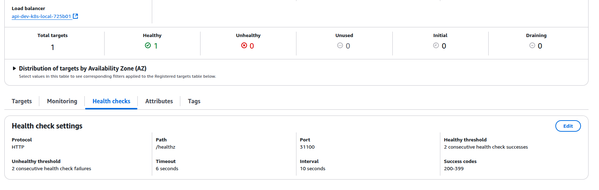

Now you can attach this target group to the Kops NLB, and everything should work as before. 

Note: Since we have modified Kops created AWS resources, we must clean up all of our changes before `kops delete cluster` command will succeed. 

